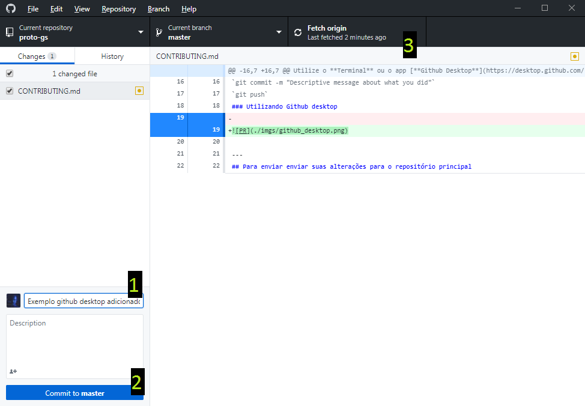
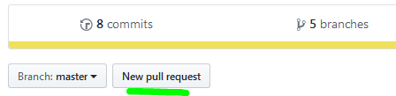

# Contribuindo ao projeto utilizando git

Utilize o **Terminal** ou o app [**Github Desktop**](https://desktop.github.com/) para fazer commits

### Atenção!
> **A sincronização**  com o repositório original (*https://github.com/WLLR9505/proto-gs.git*) **deve ser feito EXCLUSIVAMENTE NO Terminal**

## login local no terminal
`git config credential.username <username>`  
`git config credential.password <password>`

## Quando quiser que suas contribuições sejam enviadas para seu repositório

### Utilizando terminal
`git add <changed_file>`  
`git commit -m "Descriptive message about what you did"`  
`git push`  
### Utilizando Github desktop

> Verifique se os arquivos que deseja enviar estão selecionados  
> 1 : Digite a mensagem do commit  
> 2 : Clique em *Commit to master*  
> 3 : O botão Fetch origin mudara para Push origin, clique
---
## Para enviar enviar suas alterações para o repositório principal  

> vá até seu fork e clique no botão new pull request
  
> Isto fará com que suas alterações sejam solicitadas para serem embutidas ao repositório original
---
# Os comandos abaixo necessitam obrigatoriamente do uso do terminal
---
## Acrescentar upstream (necessário para sincronizar sua fork com a original)
`git remote add upstream https://github.com/WLLR9505/proto-gs.git`

## Verificar se você tem o upstream do repositório original
`git remote -v`
> Esperado **4** linhas depois de executar o comando acima, indicando as origens do repositório : **2 suas e 2 do original**  
---
## Sincronizar repositório com o principal
## Atenção!
**Sempre execute estes comandos quando for editar or projeto**  
`git fetch upstream`  
`git merge upstream/master`
